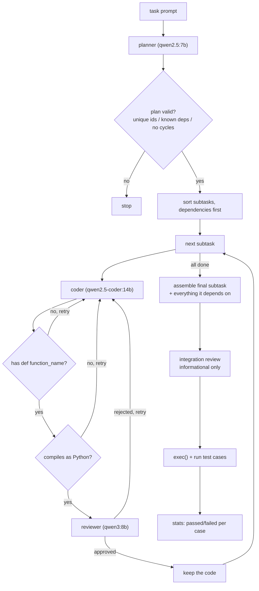

# OMAW

A fully offline multi-agent pipeline that takes a plain-English coding task, breaks it into
subtasks, writes each one with a local model, reviews it with a different local model, and then
checks the assembled result by actually executing it against real test cases. Everything runs on
[Ollama](https://ollama.com) on one machine. No API keys, no network calls.

## Architecture



Retries are capped at 6 attempts per subtask (`MAX_ATTEMPTS`). If a subtask never succeeds,
everything that depends on it is skipped rather than being built on a broken foundation.

| File | What it does |
|---|---|
| `planner.py` | Turns the task into a validated `Plan`: a dependency graph of subtasks, each with typed inputs and outputs. |
| `agent.py` | The pipeline. Builds each subtask through the coder/reviewer loop, assembles the result, runs the tests. `run_pipeline()` is the entry point. |
| `test_planner.py` | Tests for the planner's validators, plus a checker that verifies the plan's data flow actually connects up. |
| `test_writer.py` | Generates extra test cases. The model only picks the inputs; a small evaluator here works out the correct answers. |
| `rigorous_eval.py` | Runs the pipeline on three tasks unrelated to the one it was built around. |
| `bench_eval.py` | Runs it on 10 problems from HumanEval and MBPP, easy to hard. |

## Why it's built this way

**Different model for each role.** The coder is a code-specialised model, the reviewer is a
general reasoning model, and the test-case generator is from a different family entirely
(IBM Granite rather than Qwen). The point is that a model reviewing output from the same weights
that produced it tends to share the same blind spots. This is also why the test generator isn't
allowed to decide expected answers.

**`output_type=NativeOutput(...)` rather than the PydanticAI default.** This makes the model fill
in a pydantic schema directly using its own structured-output support. It's the reason every model
in the pipeline has to report the `tools` capability in Ollama. I found that out the
hard way, see the debugging notes below.

**Cheap deterministic checks run before the reviewer.** Whether code contains
`def function_name(` is a regex question, and whether it parses is a `compile()` question. Neither
needs a language model, and doing them first means a review call is never spent on code that
cannot possibly work.

**Test correctness never comes from a model.** Expected answers are either hand-written, computed
by a small `ast`-based evaluator (`test_writer.py`), or taken from a public benchmark's own test
suite. A model is only ever asked what to test, never what the right answer is.

## Setup

Requires Python 3.10+ and [Ollama](https://ollama.com) installed and running (`ollama serve`).

```bash
python3 -m venv .venv
.venv/bin/pip install -r requirements.txt
```

Pull the four models:

```bash
ollama pull qwen2.5:7b           # planner
ollama pull qwen2.5-coder:14b    # coder
ollama pull qwen3:8b             # reviewer
ollama pull granite3.1-dense:8b  # test case generator
```

Roughly 24GB of models. The coder is about 9GB on its own, which is a tight fit on an 8GB card;
Ollama will offload the overflow to system RAM and it still runs, just slower.

## Usage

```bash
python planner.py        # planner only, prints the raw plan
python test_planner.py   # validator + wiring checker tests, then one live plan
python agent.py          # full pipeline on the built-in boolean expression task
python rigorous_eval.py  # three unrelated tasks
python bench_eval.py     # ten HumanEval/MBPP problems
```

A run prints each subtask as it's attempted, then the generated code, then the test results:

```
=== tokenize_expression: Splits the expression into tokens ===
  ---Attempt 1---
  Reviewer approved: True
  Implemented as `tokenize_expression`
...
=== Testing terminal subtask 'main' (`has_cycle`) ===
PASS: ({'a': ['b'], 'b': ['c'], 'c': []},) -> False
PASS: ({'a': ['b'], 'b': ['c'], 'c': ['a']},) -> True
Test passed: True
```

A subtask that never converges looks like this, and everything downstream of it is skipped:

```
=== parse_expression: Builds an AST from the tokens ===
  ---Attempt 1---
  Code does not parse as Python (invalid syntax) — rejecting without review
  ---Attempt 2---
  Reviewer approved: False
  ...
  Failed review after 6 attempts
  parse_expression not implemented, dependents may be skipped
=== evaluate_ast: ... ===
  Skipped: unimplemented dependencies ['parse_expression']
```

Runs are slow. A single task takes roughly 15 to 40 minutes depending on how many retries the
subtasks need. `bench_eval.py`'s ten problems took several hours.

## Challenges and debugging notes

### The planner never declared any dependencies

Every subtask came back with `depends_on=[]`, on five runs out of five, even when the parameters
obviously chained (one subtask outputting `tokens`, the next taking `tokens` as input).

I assumed a 7B model just wasn't capable of reasoning about a dependency graph, and started
looking at bigger planner models. Before swapping anything I dumped the JSON schema that
PydanticAI actually sends, with `Plan.model_json_schema()`. `depends_on` was the only field
missing from the schema's `required` list, because it was declared as
`Field(default_factory=list)`. It was also the only field with no description. So from the model's
side it was an optional field with no explanation, and it did the reasonable thing and skipped it.

Removing the default and adding a description fixed it immediately, on the same model. The lesson
that stuck: when a model "can't" do something structured, check what schema it's actually being
given before blaming the model.

### The reviewer approved code that could not run

This happened twice, in two different ways.

The first time, the reviewer approved a "function" whose entire body was a single comment:
`# Renamed the function for clarity`. No `def` anywhere. It only surfaced later as
`No function named 'parse_expression_into_ast' in namespace` when the assembled code was
executed, by which point two more retry attempts had already been spent on top of it.

The second time, the reviewer approved code containing a literal two-character `\n` in the middle
of a statement, where an actual newline was meant. That's not valid Python, and it failed at
`exec()` with `unexpected character after line continuation character`.

In both cases my first instinct was to improve the reviewer prompt, and I did try that. What
actually mattered was noticing what the two failures had in common: both are mechanically
decidable. "Does this text contain `def name(`" is a regex. "Is this valid Python" is `compile()`.
Neither is a judgement call, and asking a language model to make a judgement call about something
with a definite answer is how you get a confident wrong answer.

So both became deterministic guards that run *before* the reviewer is called at all
(`has_function_def` and `syntax_error` in `agent.py`). They're free, they're exact, and they turn
a wasted review round-trip into an immediate targeted rewrite request. In the benchmark run later,
one subtask burned all six of its attempts on guard rejections alone, so the reviewer was never
called on it once.

The broader point is that the reviewer is genuinely useful for questions like "is this algorithm
right", and genuinely unreliable for questions the interpreter can answer for free.

### `NativeOutput` silently depends on the model's tool-calling support

The parser subtask kept failing on `qwen2.5-coder:7b`, so I tried `deepseek-coder:6.7b` to see
whether it was a model-specific weakness or a task-difficulty ceiling. The result was much worse:
it produced stub function bodies on essentially every attempt, far below what the model it
replaced was managing.

The obvious conclusion was that deepseek-coder is simply worse at this. That didn't sit right,
since it's a well-regarded code model, so I checked what Ollama reported about it:

```bash
curl -s localhost:11434/api/show -d '{"name":"deepseek-coder:6.7b"}'
# capabilities: ['completion']
```

No `tools`. The Qwen models report `['completion', 'tools', ...]`. `NativeOutput` relies on
structured output support, so on a model without it the schema-filling degrades badly and you get
malformed, half-empty `CodeSolution` objects. It was never a fair comparison of coding ability at
all. The harness was broken for that model.

I reverted and moved up to `qwen2.5-coder:14b` instead. The real takeaway is that model choice for
this pipeline is constrained by the `tools` capability first and code quality second, and that's
now the first thing I check before trying any new model.

### The coder kept writing a parser for the wrong language

The parse-to-AST subtask repeatedly produced a generic arithmetic Shunting-yard parser. The
reviewer's feedback on it talked about `3 + 4 * 2` and unary minus. The task was about boolean
expressions with `AND`, `OR`, `NOT` and `XOR`.

I first read this as the subtask just being too hard, since Shunting-yard with a unary operator is
genuinely fiddly. Then I printed the prompt that was actually being sent to the coder for that
subtask. It contained the subtask description and nothing else. The word "boolean" didn't appear
anywhere in it, and neither did any of the four operators. The planner had written a perfectly
reasonable but generic description ("convert the token list into an AST"), and with no other
context the model fell back on the most common version of that problem in its training data.

The fix was to thread the original task prompt into every subtask prompt and every rewrite prompt,
explicitly labelled as vocabulary and format context rather than as the thing to implement. The
drift stopped.

### Letting a model write its own test cases is circular

Once the pipeline could generate extra test cases, the obvious problem was that if the same model
writes the code and the tests, it can be wrong about the spec in both places at once and every
test still passes.

I split it so the model only ever proposes inputs, and a small `ast`-based evaluator in
`test_writer.py` computes the expected answers. `TestCase` has no `expected` field at all, so it
isn't a matter of trusting the model to behave, it structurally can't supply one.

Then the generator itself turned out to be unstable. `granite3.1-dense:8b` scored 12/12 valid
cases on one run and 2/12 on the very next run, with the same prompt and the same model. It kept
writing `&&` and `||` instead of `AND` and `OR`. That's sampling variance, which means a single
good run proves nothing. Adding an explicit list of forbidden operators and one worked example to
the prompt brought it to 33/35 across three separate runs.

Also worth recording: the evaluator I wrote to grade the model had a bug of its own.
`reference_eval("NOT a", ...)` raised `IndentationError`, because substituting `NOT` for `not`
leaves a leading space and `ast.parse(" not a", mode="eval")` rejects it. I only caught it because
I ran the evaluator against the known-correct hand-written cases before trusting it with anything
else.

### The plan checker reported a broken plan as fine

`check_param_wiring` in `test_planner.py` exists to confirm that a plan's declared data flow
actually connects up. It passed a plan where every single subtask had `depends_on=[]` while the
parameters clearly chained through.

The checker classified an input as `ROOT INPUT` (fine, comes from the task itself) whenever the
subtask had no declared dependencies. But "no declared dependencies" was precisely the broken case
it was supposed to catch. The one branch that should have fired was disabled by the exact
condition it was meant to detect.

The fix was to search every subtask's outputs for a producer regardless of what dependencies were
declared, so a parameter another subtask produces is reported as `MISSING DEP` rather than quietly
accepted. I also added seven self-tests built from plans with known defects in them, because a
checker that has never been run against a known-bad input is just an assertion that things are
fine.

## Results

| Evaluation | Tasks | Fully passing |
|---|---|---|
| `rigorous_eval.py` | RPN calculator, graph cycle detection, edit distance | 2 / 3 |
| `bench_eval.py` | 10 HumanEval + MBPP problems, easy to hard | 5 / 10 |

The RPN failure was a single bug: the generated code used `token.isdigit()` to detect numbers, and
`"-7".isdigit()` is `False`, so every negative number was rejected as invalid. In the benchmark
run all five failures had different causes, which is worth more than the score. No single fix
would have addressed them.

## Known limitations

These are real and unfixed, not things I ran out of time to write up.

- **No timeout on test execution.** `run_tests` calls `exec()` on generated code with no time
  limit or sandbox. One infinite loop in generated code and the run hangs indefinitely. Nothing
  has triggered it yet, which is luck rather than design.
- **Test failures don't feed back to the coder.** The reviewer is the gate. Tests run once, at the
  end, on the assembled result. A subtask that passes review and then fails its tests gets no
  retry, which is the most obvious missing edge in the whole flow.
- **Composition is often an illusion.** Subtasks frequently reimplement the entire solution under
  the same function name instead of calling the dependencies they were given, despite an explicit
  instruction not to. `combined_code` then concatenates several same-named functions and Python
  keeps the last one. When that last one happens to be correct, the tests pass, but that's one
  subtask solving the whole problem alone, not modular composition.
- **`Plan` accepts zero subtasks.** Schema-legal and useless. One benchmark problem returned an
  empty plan and the pipeline just did nothing.
- **Terminal detection breaks on multi-root plans.** Anything with no dependents is treated as an
  entry point, so a decomposition that accidentally leaves an orphaned helper will have that
  helper tested against the real task's inputs. It fails with a `TypeError` about argument counts.
- **The reviewer doesn't check signatures.** It approved a function returning `(bool, int)` for a
  task that specified `-> bool`.
- **Test generation only understands the boolean expression task.** Every other evaluation passes
  `use_test_writer=False` and supplies hand-written or benchmark-sourced test cases instead.
- **Every result here is a single trial.** These models are stochastic enough that identical
  prompts produce noticeably different quality run to run, so the numbers above indicate roughly
  where it sits, not a reproducible pass rate.

## Roadmap

None of this is built yet.

- Timeout and sandboxing on the test execution step, which is the most urgent one.
- Feed test failures back into the coder loop so execution results actually gate a subtask
  instead of only reporting on it.
- Enforce a minimum subtask count and a single terminal subtask in the `Plan` schema, closing the
  two gaps the benchmark run found.
- Generalise test case generation beyond the boolean expression domain.
- Repeat-trial evaluation (pass@k style) instead of single runs, so results mean something.
- An MCP server so the pipeline can be driven from other tools.
- Retrieval over a reference corpus, so the coder has something better than its own priors when it
  hits an unfamiliar algorithm.

## Involvement of AI

Yeah AI was used to edit some of the code and test it. The major involvement of AI was in the testing (test_planner.py and test_writer.py) and the eval (bench_eval.py). Other than that the rest of the code was written by me and AI has at most restructured it or added comments. Also this readme is AI generated since i couldnt be bothered to write it 
